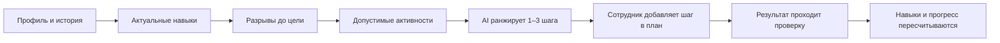

# Career Quest

**AI-навигатор развития сотрудников для кейса Halyk Bank · HackAlem AI 2026**

Career Quest превращает разрозненные данные о навыках, карьерной цели и истории обучения в конкретный следующий шаг. Сотрудник видит **что развивать, зачем и какой результат ожидается**, а HR — **где сосредоточены дефициты команды и кому нужна поддержка**.

> Профиль + история + цель → 1–3 объяснимые рекомендации → личный план → проверенный результат → обновлённый прогресс

## Проблема

Корпоративный каталог обучения отвечает на вопрос «что доступно», но не отвечает на вопрос сотрудника: **«что поможет именно мне приблизиться к следующей роли?»**

- рекомендации без карьерного контекста выглядят случайными;
- пройденная активность не всегда означает приобретённый навык;
- HR видит множество записей, но не получает понятной картины дефицитов;
- повторный курс может быть формально подходящим, но уже не давать прироста.

## Решение

Career Quest строит путь от карьерной цели к проверяемому действию:



Система не рекомендует мероприятие только потому, что оно совпало по названию навыка. Она проверяет аудиторию, требования, расписание, историю участия, уже начатые и завершённые шаги, реальный прирост и потолок каждого мероприятия.

## Ценность продукта

| Для сотрудника | Для HR и бизнеса |
|---|---|
| Понятный следующий шаг вместо длинного каталога | Карта дефицитов по подразделениям и грейдам |
| Объяснение через цель, разрыв и историю | Список сотрудников, которым нужна поддержка |
| Ожидаемый прирост навыков до начала активности | Проверяемый цикл от рекомендации до результата |
| Личный план и прогноз покрытия цели | Загрузка новых профилей без изменения кода |

## Что реализовано

### Персональные рекомендации

- до трёх подходящих активностей;
- численный эффект, например `System Design 1 → 2`;
- объяснение через карьерный разрыв и историю сотрудника;
- исключение обязательных, недоступных, бесполезных и уже пройденных шагов;
- честное пустое состояние: цель достигнута, шаг уже в плане или каталог не закрывает потребность.

### Личная траектория

- текущие уровни и требования целевой роли;
- приоритетный критичный разрыв;
- состояния плана: `запланировано → в работе → на проверке → завершено`;
- прогноз прогресса отдельно от фактических навыков;
- сохранение версий работы и обратной связи.

Навыки не меняются от одного нажатия «начать». Прирост применяется только после подтверждённого результата и не начисляется повторно.

### HR-пространство

- дефициты команды относительно индивидуальных целей;
- фильтры по подразделению, грейду, навыку и сигналу поддержки;
- поиск по имени, ID и роли;
- согласованные показатели и список сотрудников для выбранного фильтра;
- импорт новых профилей и истории через безопасный предпросмотр.

HR выступает координатором развития. Технические задания и их содержательную оценку должен согласовывать компетентный руководитель или эксперт. В прототипе проверка доступна через общий HR-кабинет; отдельного назначения экспертов пока нет.

### Если каталога недостаточно

Сотрудник может запросить индивидуальную практику по незакрытому навыку. HR согласует ожидаемый результат и критерии, после чего сотрудник добровольно добавляет задание в план. Для демонстрации подготовлен редактируемый кейс по проектированию сервиса уведомлений.

Это дополнительный сценарий. Основная ценность продукта — качественный и объяснимый подбор из существующего каталога.

## Как работает AI

1. Сервер вычисляет актуальные навыки, разрывы и список допустимых мероприятий.
2. В модель передаются обезличенные признаки: роль, грейд, стаж, формат работы, цель, разрывы и агрегированная история.
3. Модель ранжирует до трёх кандидатов и выбирает подтверждающие факты.
4. Сервер проверяет каждый `event_id`, факт, критичность и численный эффект.
5. Только проверенный результат показывается пользователю.

Модель не может придумать мероприятие, навык или число. Имена, ID сотрудников и сырые строки истории не отправляются. При недоступности провайдера включается явно обозначенный многофакторный подбор по правилам — основной сценарий остаётся рабочим.

Используются OpenAI Responses API и Structured Outputs. Модель по умолчанию — `gpt-4.1-mini`. Один контрольный live-вызов занял **4,44 с**; это отдельный замер, не гарантия задержки под нагрузкой.

## Данные и расчёт прогресса

Исходный синтетический набор:

| Сущность | Количество |
|---|---:|
| Сотрудники | 200 |
| Мероприятия | 40 |
| Навыки | 60 |
| Профили ролей | 32 |
| Записи истории за 24 месяца | 2 743 |

Навыки из последней аттестации дополняются завершениями после `last_review_date`. Эффект активности ограничен шкалой 0–5 и её собственным потолком:

```text
new_level = max(current_level, min(5, max_level, current_level + gain))
```

Покрытие цели показывает долю уже достигнутых уровней целевого профиля. Это индикатор развития, а не вероятность повышения.

Дополнительные `employees.json` и `activity_history.csv` проходят проверку схемы, связей, дат и повторов. До сохранения HR видит, сколько записей будет создано, изменено или оставлено без изменений. Подтверждение выполняется одной транзакцией.

## Быстрый запуск

Требуются Docker Desktop или Docker Engine с Compose.

```bash
git clone https://github.com/BAITC-Hacks/hack-3cd2281d-meta-juniors.git
cd hack-3cd2281d-meta-juniors
docker compose up --build -d
```

Открыть [http://localhost:8000](http://localhost:8000). Первый запуск применит миграции, загрузит датасет и создаст демо-аккаунты. PostgreSQL хранится в Docker volume и не сбрасывается при обычном перезапуске.

| Роль | Логин | Пароль |
|---|---|---|
| Сотрудник, профиль E0028 | `employee` | `career-demo-2026` |
| HR | `hr` | `career-demo-2026` |

На странице входа есть кнопки обеих демо-ролей. Если порт 8000 занят, добавьте в `.env` строку `APP_PORT=8001` и откройте `http://localhost:8001`.

Полезные команды:

```bash
docker compose ps
docker compose logs --tail=50 web
docker compose down
```

`docker compose down` сохраняет данные. Не добавляйте `-v`, если PostgreSQL volume нужно оставить.

## Подключение OpenAI

Создайте `.env`, только если его ещё нет:

```powershell
if (!(Test-Path .env)) { Copy-Item .env.example .env }
```

Добавьте ключ OpenAI Platform:

```dotenv
OPENAI_API_KEY=ваш_API_ключ
OPENAI_MODEL=gpt-4.1-mini
```

Пересоздайте web-контейнер:

```bash
docker compose up -d --force-recreate web
```

Ключ используется только сервером, не передаётся в браузер и исключён из Git. Без ключа приложение автоматически работает в резервном режиме и показывает это в интерфейсе.

## Демо за 3 минуты

1. Войти как **employee** и показать цель, разрывы и карточки рекомендаций.
2. Открыть «Почему этот шаг подходит» и численный ожидаемый прирост.
3. Добавить рекомендацию в план: прогноз изменится, фактические навыки — нет.
4. Войти как **HR** и показать дефициты команды и фильтр по навыку.
5. Открыть загрузку данных и объяснить предпросмотр неизвестных профилей.

Для отдельного примера корректного исключения откройте через HR профиль **E0028** после завершения `Designing High-Load Systems`: повторный `System Design Fundamentals` с потолком 3 уже не даёт прироста и не должен рекомендоваться для цели Senior с требованием 4.

Подробный сценарий: [docs/DEMO.md](docs/DEMO.md).

## Архитектура

```text
Django Templates + JavaScript
            │
       Django / DRF
       ├── career.py          актуальные навыки и разрывы
       ├── recommendations.py AI, валидация и fallback
       ├── plans.py           переходы личного плана
       ├── practice.py        задания, версии и проверка
       ├── trajectory.py      прогноз без записи в навыки
       └── importer.py        preview и атомарный импорт
            │
       PostgreSQL 16
```

Стек: **Python 3.12 · Django 5.2 LTS · DRF · PostgreSQL 16 · OpenAI Responses API · Pydantic · JavaScript · Docker Compose · Waitress · WhiteNoise**.

Ролевой доступ построен на Django sessions, группах и CSRF. Сотрудник видит только собственные профиль, план и работы. HR не может менять карьерную цель или план за сотрудника. Самопроверка результата запрещена.

## Проверка качества

```powershell
.\.venv\Scripts\python.exe manage.py test
.\.venv\Scripts\python.exe manage.py check
.\.venv\Scripts\ruff.exe check .
```

В финальной сборке:

- **68 тестов** проходят на SQLite и PostgreSQL 16;
- контейнеры `web` и `db` проходят healthcheck;
- проверены вход, роли, CSRF, импорт, рекомендации, переходы плана, возврат работы и идемпотентность подтверждения;
- медиана локального HTTP-ответа: профиль **61,1 мс**, HR-обзор 200 сотрудников **253,4 мс**;
- мобильный интерфейс проверен при ширине 390 px.

Автотесты не расходуют API-кредиты: ответы модели там заменены контролируемыми данными. Live-проверка описана отдельно в [docs/VERIFICATION.md](docs/VERIFICATION.md).

## Ограничения прототипа

- нет промышленной интеграции с корпоративными SSO и LMS;
- нет отдельной роли и механизма назначения технического эксперта;
- интерфейс преимущественно на русском, названия каталога сохранены на английском;
- прирост навыка основан на правилах синтетического датасета и не заменяет аттестацию;
- влияние на вовлечённость ещё не измерено на реальных пользователях;
- качество и задержка live-AI зависят от модели, сети и API.

## Документация

- [Discovery Matrix — исходный анализ](docs/analytics/Discovery%20Matrix%20AS-IS.xlsx)
- [Solution Validation Matrix — реализация и доказательства](docs/analytics/Solution_Validation_Matrix.xlsx)
- [Архитектура, формулы и принятые решения](docs/ARCHITECTURE.md)
- [Сценарий защиты](docs/DEMO.md)
- [Результаты проверок и измерений](docs/VERIFICATION.md)
- [Описание исходного датасета](data/README.ru.md)

## Команда

**Meta Juniors** · HackAlem AI 2026 · трек «Управление» · кейс Halyk Bank.

Данные предоставлены организатором и являются синтетическими. Код решения разработан командой во время хакатона с использованием Codex. Готовый сторонний проект Career Quest не использовался.

OpenAI: [Structured Outputs](https://developers.openai.com/api/docs/guides/structured-outputs) · [GPT-4.1 mini](https://developers.openai.com/api/docs/models/gpt-4.1-mini)
